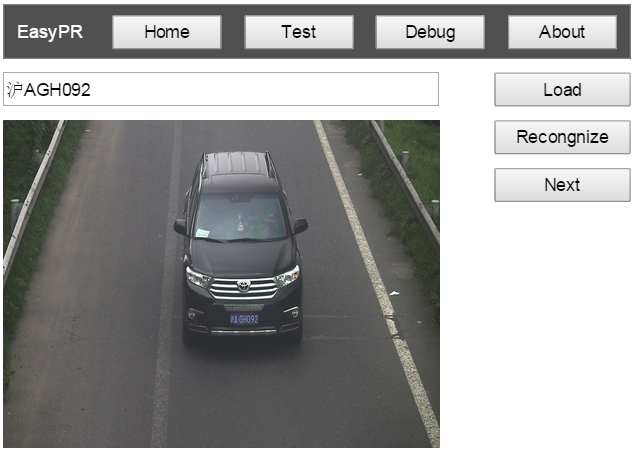

# easyPR-prototype
a prototype of plate recognize application, including web, app etc. 

Introduction 简介
------------
easyPR-prototype基于[EasyPR-Java](https://github.com/mumu10/EasyPR-Java),是一个个人学习web、application、IOT等开发知识的一个原型类的项目。本项目将涉及产品的整个设计、开发、发布和维护流程，主要关注新的软件领域里新的设计理念、工具开发链等。

Web
------------

#### Object 目标
学习基于GWT的网页开发

Axure
------------
本项目的所有原型都会使用Axure开发

Structure
------------
|folder | Intrduction 
|------|----------
| prototype |  prototype design, including the files of Axure
| web | for web application
| doc | documentation
